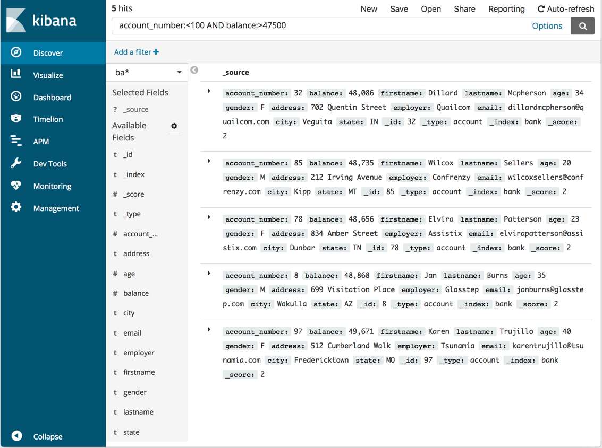
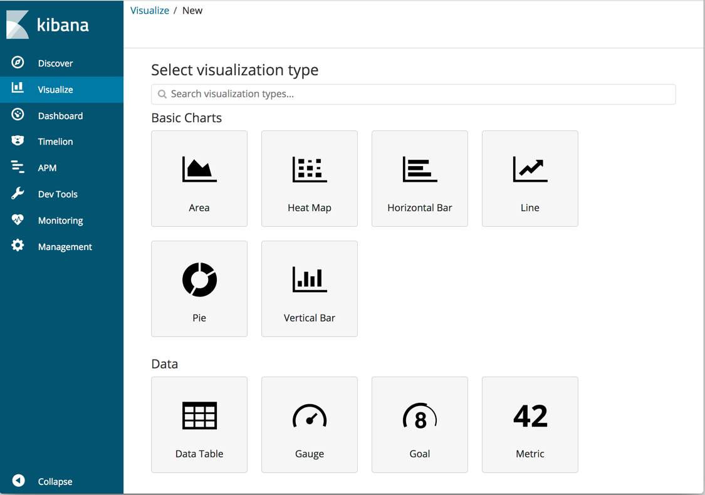
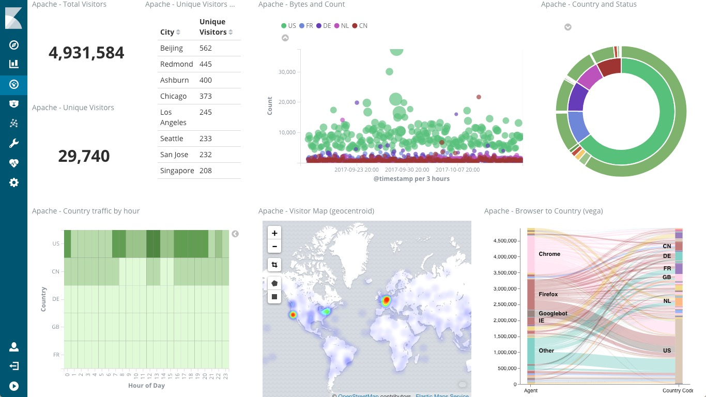
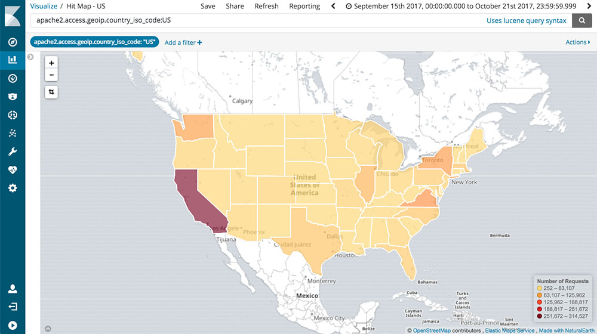
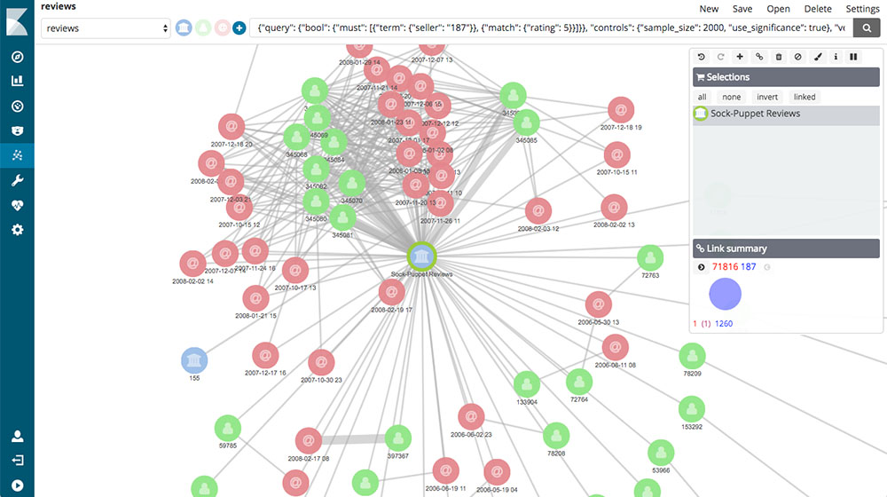

# Kibana

Si bien ElasticSearch y Logstash pueden ser consultados o invocados utilizando software programado a medida y comandos en el servidor para realizar consultas a los índices, es importante poner a disponsición estas bases de datos a todo tipo de usuarios. Esa es la importancia de Kibana.

Kibana es la interfaz gráfica de usuario de la plataforma ELK. Y permite realizar análisis, consultas y visualizaciones de distintos tipos de los datos en nuestros índices.

## Funcionalidades

### Explorar los datos (Discover)

Una de las funcionalidades más básicas de Kibana es poder explorar los datos, documento a documento, o mediante consultas especializadas.

Más adelante conoceremos más sobre el lenguaje ([Query DSL](https://www.elastic.co/guide/en/elasticsearch/reference/6.4/query-dsl.html)) que Kibana y ElasticSearch utilizan para la construcción de consultas más avanzadas.

### Visualizar los datos (Visualize)

En esta función podremos crear gráficas, mapas y otro tipo de visualizaciones con los datos en nuestros índices.

> Para realizar mapas, nuestros documentos deberían contener información como coordenadas geográficas. Para realizar gráficas con sumas o totales, nuestros documentos deberán contener datos numéricos.

### Crear y compartir tables de información (Dashboard)

Esta función es muy popular cuando ya tenemos definidos qué es lo que información queremos obtener de nuestros índices y de que forma queremos visualizarlo.

Un Dashboard es una colección de visualizaciones que se actualizan en tiempo real y que pueden ser compartidas a usuarios fuera de la plataforma.

### Consola de desarrollo y otras funciones

Entre otras herramientas, Kibana también permite realizar consultas manuales sobre nuestros clústers e índices usando una consola de desarrollador, esta es una funcionalidad avanzada que puede servir para corrección de errores.

También, dependiendo de las configuraciones, puede exhibir un panel de administración de usuarios, índices y documentos. También permite monitorear el correcto funcionamiento de nuestra plataforma ELK por completo. 

Algunas funcionalidades avanzadas requieren la compra de licencia a la empresa Elastic.co, en este manual trabajaremos sólo con las funcionalidades gratuitas disponibles en la versión libre de la plataforma ELK. 

## Más ejemplos

